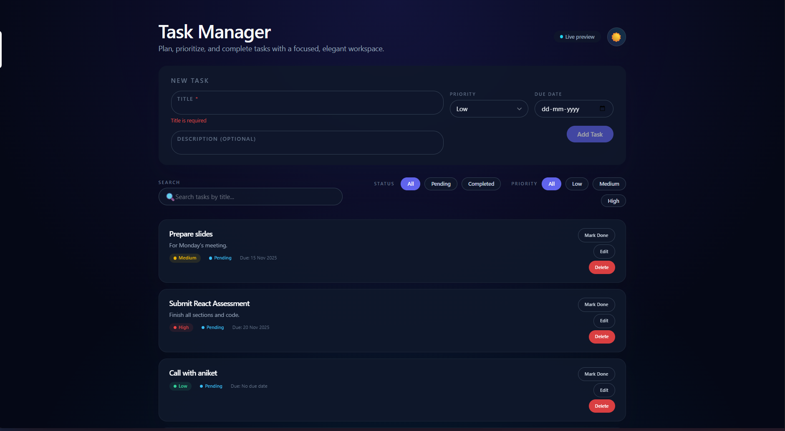

<p align="center">
  
</p>

# Nelo Task Manager

A polished, modern Task Manager built with React, Vite, and Tailwind CSS. Designed to look and feel like a real product: dark/light mode, smooth micro-animations, and a focused, minimal experience for getting work done fast.

## Highlights

- Beautiful layout with gradient background and soft animated blobs
- Toggleable dark/light mode with a single, global theme switch
- Floating-label task form with validation (title, description, priority, due date)
- Powerful filters:
  - Status: All / Pending / Completed
  - Priority: All / Low / Medium / High
  - Search: case-insensitive by title
- Elegant task cards:
  - Priority + status chips
  - Clean typography and spacing
  - Hover/press interactions
- Accessible modals for Edit and Delete:
  - Centered, blurred backdrop, Esc/overlay to close
  - Focus management and inline validation
- Subtle toast notifications for add/edit/delete/complete

## Tech Stack

- React 18 + Vite
- Tailwind CSS (+ @tailwindcss/forms)
- LocalStorage for task and theme persistence
- Clean, componentized UI with no external design-system lock-in

## Getting Started

```bash
npm install
npm run dev
# open http://localhost:5173
```

## Core Ideas

- Single source of truth for tasks and filters
- Deterministic, testable filtering and sorting logic
- Pixel-perfect spacing and responsive layout for mobile → desktop
- Accessible by default: labels, roles, keyboard-friendly dialogs
